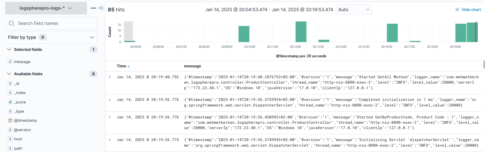

# LogSpherePro

## Overview
Log Sphere Pro is a project designed to efficiently handle and visualize logging data in real-time. It provides an easy-to-use interface for users to monitor logs, set up notifications, and manage data flow, making it ideal for developers and system administrators looking for a streamlined logging solution.

## Using Technology
- **JDK 17**
- **Spring Boot**
- **MDC**
- **LogBack**
- **Elasticsearch**
- **LogStash**
- **Kibana**

## Kibana Access 
http://localhost:5601

## Elasticsearch Access
http://localhost:9200

## Kibana Screenshot

